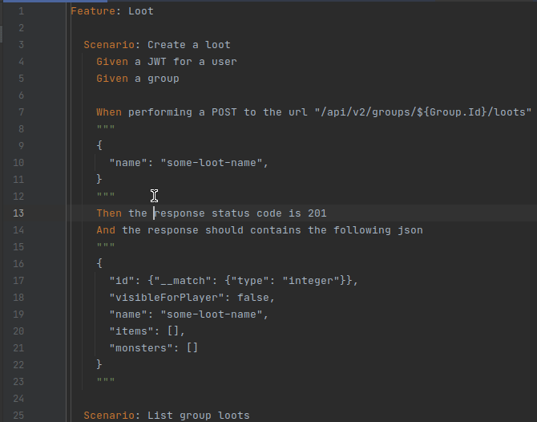

# SpecFlow Support for ReSharper and Rider
The "SpecFlow Support" plugin adds specific functionality for the [SpecFlow](https://specflow.org/) to [Rider](https://www.jetbrains.com/rider/). (Resharper will come if requested enough)

**IMPORTANT**: This plugin is still at it's begining, It may be still buggy. Don't hesitate to report any bug or cool feature to add and don't forget to :+1: any feature you want to help prioritize them.

## Build plugin

```shell
./gradlew :buildPlugin
```

You can find CI builds in [Actions](https://github.com/Socolin/resharper-specflow/actions) tab

## Features

### Syntax highlight


### Go to step declaration



### Error highlight on missing step and Create Step quick fix


## Notes

Thanks to all the people on the `#dotnet-pluginwriters` Slack channel for their help !
Thanks to [Settler](https://github.com/Settler) and [threefjefff](https://github.com/threefjefff) for their works on this.