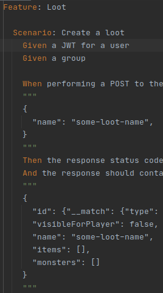
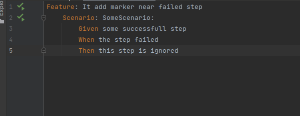

[](https://plugins.jetbrains.com/plugin/24012-reqnroll-for-rider)

# Reqnroll Support for ReSharper and Rider
The "Reqnroll Support" plugin adds specific functionality for the [Reqnroll](https://reqnroll.net/) to [Rider](https://www.jetbrains.com/rider/). (Resharper will come if requested enough)

**IMPORTANT**: This plugin is still at it's beginning, It may be still buggy. Don't hesitate to report any bug or cool feature to add and don't forget to :+1: any feature you want to help prioritize.

## Usage
See [Setup Rider](https://docs.reqnroll.net/latest/installation/setup-ide.html#setup-rider)

### Limitations

- For now, it only supports step definitions using [Regular expressions in attributes](https://docs.reqnroll.net/projects/reqnroll/en/latest/Bindings/Step-Definitions.html#step-matching-styles-rules). If you are interested in the other ones, please open an issue.

## Features

All those feature should work out of the box for existing projects. If something is not working, please report it with a sample of code (step / step definition) of what is not working. Also check for error notification in the bottom status bar of Rider.

### Syntax highlight



### Go to step declaration


### Error highlight on missing step and Create Step quick fix


### Run tests from Reqnroll files


### Rename step definition to match with their pattern


### Highlight the failing steps after running tests



Note: If this is not working, try to add the following configuration in the `reqnroll.json`
```json
{
  "trace": {
    "traceTimings": true
  }
}
```

## Build plugin

```shell
./gradlew :buildPlugin
```

You can find CI builds in [Actions](https://github.com/reqnroll/Reqnroll.Rider/actions) tab

## Notes

Thanks to all the people on the `#dotnet-pluginwriters` Slack channel for their help !
Thanks to [Settler](https://github.com/Settler) and [threefjefff](https://github.com/threefjefff) for their works on this.
