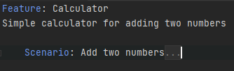

# How it works

This document describes how this plugin is working. It aims to explain some basics to simplify further contributions.

## PSI (Lexer / Parser)

The custom language part is explained [in the resharper dev guide](https://www.jetbrains.com/help/resharper/sdk/CustomLanguages_Overview.html)

The language behind `.feature` is Gherkin, so every class related to the language part are named with `Gherkin` in them (And the one related to SpecFlow like references between C# / .feature and other things like that are name with `Specflow`.

The Lexer/Parser code that build the Gherkin's `ITreeNode` can be found in `PSI/` folder. The goal of all this is to provide syntax highlighting, and a tree style structure `GherkinFile` which can be walked to find `Feature`, `Scenario`, and `Step`

Those class are just a representation of the text file as `ITreeNode` with no additional information.

## Caches

Rider use caches to improve performance of some features (see the documentation about [Caching](https://www.jetbrains.com/help/resharper/sdk/PSI/Caching.html)) for more information

A cache iterate over all files of the solution and update in memory structure that can be used later for quick lookup. To be kept up-to-date, when a file change, the cache analyzed again this file (and only this one).

In this plugin there are various caches:

### SpecflowSettingsFilesCache

This cache look for the `specflow.json` file and update the settings. Those settings can be access by injecting `SpecflowSettingsProvider`

There is a special case for this one, if it detects a change in the locales, it invalidates other related caches

### SpecflowStepsDefinitionsCache

This cache keeps the list of files that may contains C# step definition and all the steps definitions

### SpecflowStepsUsagesCache

This cache keeps the list of all step in `.feature` files

## Daemons

Daemons are the process that iterate over files after the caches to provide various code analysis, like all the highlightings (error, warnings, gutter marks etc...)

Those daemons can be called in various context (see `DaemonProcessKind`) for example they can be executed on all the files in case of `SOLUTION_ANALYSIS` of only on the active file in case of `VISIBLE_DOCUMENT` depending on of the need, some daemons do nothing for some process. (No need to run the daemon that add the icon in the gutter for all the files, this one will run only for `VISIBLE_DOCUMENT` )

### UnresolvedReferenceHighlight

This daemon adds highlighting on steps that does not have any step definition in C# code. It's not doing much, only trying to resolve each `GherkinStep` and if they cannot be resolved it add highlithing

See References section below for more details about this.

TODO: If a step definition can be found in one assembly not specified in `specflow.json` it should add another kind of error to allow a quickfix that will add the assembly to `specflow.json`

### MethodNameMismatchPattern

This daemon adds highlighting on C# methods when the method name does not match the pattern in the attribute `[Given]` `[When]` `[Then]`

Since this highlighting has its severity configurable, it's been declared in `CSharpErrors.xml` and the associated C# file is generated during build. See [resharper-unity](https://github.com/JetBrains/resharper-unity/blob/net211/resharper/resharper-unity/src/CSharp/Daemon/Errors/CSharpErrors.xml)  for more examples.

### ParameterHighlighting

This daemon adds highlighting on parameters when the parameter matches the regexp pattern on the step definition in the C# code.
`ParameterHighlightingProcessor` class responsible for trying to find all the parameters based on the regexp pattern and if it finds them, adds the highlighting.

#### Example

Gherkin step:

`Given the first number is "50"`

Step binding:

`[Given("the first number is (.*)")]`

`public void GivenTheFirstNumberIs(int number)`

`{}`

In this case **"50"** matches the **(.\*)** pattern.

## Folding

The implementation of the folding can be found in the `SpecFlowFoldingProcessor` class.
The following sections are foldable:
- Scenarios
- Scenario Outlines
- Example blocks
- Rules

If a section is folded, the keyword and the title are still visible, but the rest of the section is hidden.
e.g.

## Reference

The references systems in resharper allow to link a declaration with its usage.

A good summary from Matt Ellis on the `#dotnet-pluginwritters`
> To recap a little, IReference is an outgoing reference from a tree node. It can be first class (implemented by the language itself) or come from a provider (via the factory interfaces). The reference doesn’t really point to anything until you try to resolve it, at which point it tries to find candidate declared element(s). These can be used for completion, or for navigation, or for error highlighting. If a reference fails to resolve, it is highlighted as an error - the dreaded red code. It is up to the custom language to provide this highlighting. Once the references are in place, find usages and navigation should come out of the box. Find usages is just a reverse lookup - find files with a matching name, the resolve all outgoing references with that name and see if they resolve to the target element. Implementing the reference correctly will also mean rename works.

So this is what the `SpecflowStepDeclarationReference` is doing, it's taking a `GherkinStep` as input and provide the method `ResolveWithoutCache` in charge of finding the C# method that declare this step. This process uses the cache `SpecflowStepsDefinitionsCache`

This reference is built in `GherkinStep` constructor and accessed via `GherkinStep.GetFirstClassReferences()`

There is a tricky part here with specflow, to get the `Find Usages` working since specflow steps text does not match specflow step definition method name, there is a class: `SpecflowSearcherFactory` that resolve this problem by providing for a given method, ths potential files that may reference this step definition. This last part use the cache `SpecflowStepsUsagesCache`

## Quick fixes

Quick fixes are actions, linked to a highlighting, see the doc [here](https://www.jetbrains.com/help/resharper/sdk/QuickFixes.html) 

### CreateMissingStepQuickFix

This fix allows creating C# method to define a step based on a step in a `.feature` file.

It will appear on `NotResolvedError` highlightings. (added by the `UnresolvedReferenceHighlight` daemon)

### MethodNameMismatchPatternQuickFix

This fix will allow to rename a method to match the pattern.

TODO: Use rename refactoring instead so other reference can be updated at the same time 

## Test explorer

### SpecflowUnitTestProvider

This test explorer find matching tests from the test repository for each Scenario and Feature. This is what is behind the `Run unit test` icon in the gutter.

## Analytics

The AppInsights REST api is used to collect anonymous usage data similarly to SpecFlow. 
The official AppInsights SDK collects and sends more data than what we need so we are controlling
what data do we send.

The users can opt out by setting the `SPECFLOW_TELEMETRY_ENABLED` environment variable to `0`

The users are identified by the SpecFlowUserId stored in the `SpecFlow\.userid` in the `SpecialFolder.ApplicationData` 

The main parts of the Rider specific implementation:

- `AnalyticsTransmitter` this class is responsible to collect the generic information included in every event
- `SolutionTracker` this class is responsible to check if the opened solution contains a reference to SpecFlow and fire the solution loaded event
- `PluginTracker` is created for each Shell instance and fires the extension loaded/installed events

### Setting the InstrumentationKey

The Rider project includes the `AppInsightsConfiguration.template.cs` which is ignored from the build.
During the build an `AppInsightsConfiguration.cs` file is generated with the InstrumentationKey provided by MSBuild.

For development a testing key is present in the csproj file.

For production deployments the key can be overwritten using the environment variable `APPINSIGHTSINSTRUMENTATIONKEY`  
The `compileDotNet` task is configured in the `build.grade` to take this parameter and pass in to MSBuild.

## Tips

- When running rider (using gradle `:runIde`) You can attach the process `dotnet exec --runtimeconfig` to debug the extensions and explore rider code.
- You can access Resharper decompiled from rider using `Go to symbol...` by name, of by using `Go To definition` / `Find usage`.
- The jetbrains dev guide is sometimes outdated and example does not always work.
- To search the jetbrains dev guide, seach directly in the markdown files available [here](https://github.com/JetBrains/resharper-devguide)
- Here are some plugins that can be used as example
    - https://github.com/jetbrains/ForTea
    - https://github.com/JetBrains/resharper-unity
    - https://github.com/JetBrains/fsharp-support
    - https://github.com/Socolin/NSubstituteComplete