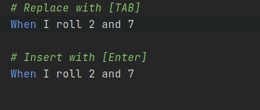
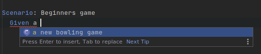
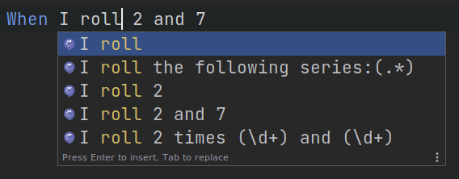
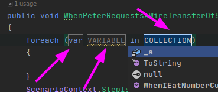

# Completion

## Base

The completion in Gherkin files is enabled by the `GherkinCompletionContextProvider` which is responsible for initializing the completion context `GherkinSpecificCodeCompletionContext`

Inside this context, we can find various information. The basics information about the current document, the location of the caret, access to the services, etc... can be found in the `BasicContext` which contains the data filled by Rider. Other fields of this class are computed values that will be accessible in all the `*CompletionProvider` afterward.

`GherkinSpecificCodeCompletionContext` expose the following things:
- `NodeUnderCursor` which is the "interesting" node under the cursor, the idea of this is to provide things access to the Step / Scenario / Feature and not the token that will force to walk the tree up to find which node is here.
- `Ranges` contains 2 variables: `InsertRange` and `ReplaceRange` those are used during completion. If the user selects an item in the completion list and press `[Enter]` the inserted text will replace the text contained by the `InsertRange` if the user uses the key `[Tab]` it will insert the text replacing the text in the `ReplaceRange`. Here an example for visual comprehension:

## Step completion

### High-level information

The plugin provides auto-completion for steps

The way it works is by listing all the step definitions using the [`SpecflowStepsDefinitionsCache`]() and the [`AssemblyStepDefinitionCache`](). Then it iterates over all the steps for the given step kind (_Given_, _When_ and _Then_) and sees if the step matches the text already typed (`partialStepText`).

### Terminology

- `caret`: The cursor location
- `partialStepText`: The text between the end of the keyword and the caret.
- `stepText`: The full existing text for the current step, goes beyond the caret.
- `LookupItem`: It represents a suggestion in the list

#### Example

- `partialStepText = "I roll"`
- `stepText = "I roll 2 and 7"`
- `LookupItems`: `I roll`, `I roll the following series:(.*)` ...

### Detailed algorithm

- Retrieve all step definition of the same kind of the current step
- For each step
  - Ensure the `partialStepText` partially match the step definition regex
  - Extract all the current parameter values from the `stepText`
  - Expand the step definition regex for all possible values (only keep matching expansion)

#### Partial Regex Matching

Since step definitions are Regex we cannot search for steps starting with this text. Instead, we have to do partial regex matching.
Dotnet Regex does not offer this option yet, and [Rider crash when trying to use PCRE.Net](https://youtrack.jetbrains.com/issue/RIDER-59118). So there is a project `Regex` which is an [Open source implementation of a Regex parser](https://github.com/codewitch-honey-crisis/Regex/tree/master/Regex) that was tweaked to support partial regex matching.

If you are curious about the details, the library is linked to an [article](https://www.codeproject.com/Articles/5251476/How-to-Build-a-Regex-Engine-in-Csharp#_articleTop) that explain how Regex works under the hood. In few words: Regex is parsed into and a graph is created. Then each letter from the input is read, and it tries to move forward in the graph. If at some point no transition exists for the current letter, the regex match fails, and when an _accept_ state is reached, it's a match.

Partial regex matching does the same but instead of returning success if the state is an _accept_ state when we reach the end of the input string, we return OK for any states.

#### Extracting The Current Parameter Values

This step is here to preserve the existing parameter values in a step.

Let's use a simple example:

Given the following step definition pattern `I roll (\d+) and (\d+)`
And the following `partialStepText` `I roll 2 and`

The objective is to extract the `2` from the `partialStepText` and replace it with the pattern before suggesting the pattern to the user. So instead of suggesting the completion `I roll (\d+) and (\d+)` we are going to suggest `I roll 2 and (\d+)`  (An later the `(\d+)` will be replaced too, see below)

To perform that task, again it would be nice if the regex parser would be able to give us the captured values while doing a partial match. Unfortunately, this is not possible, since, during a partial match when the regex ends, it may be on multiple valid states and cannot choose which one it should use to return the captured values.

So the trick is to create one regex for each capture group (see `SpecflowStepInfo.RegexesPerCapture`) and execute them one after another to try to capture the first value, then the seconds, etc...

For this let's use another example: `I roll (.+) times (.+) and (.+)`

So this would build the 3 following regex (done in `SpecflowStepInfoFactory`):

- `I roll (.+)`
- `I roll (.+) times (.+)`
- `I roll (.+) times (.+) and (.+)`

Then to match `I roll 2 times 3 and` we would try to match this text with all the regex up to the point it does not work anymore. Each time we capture one parameter value. This is done in `StepPatternUtil.RetrieveParameterValues`.

Since this not perfect yet due to the (.+) at the end that may catch something we don't want.
With the example, the regex `I roll (.+) times (.+)`, will catch `3 and` as the second parameter value. So the autocomplete will show `I roll 2 times 3 and and (.+)` (note the double `and`). To fix this, some transformations are done those Regex:
- The greedy capture like `.+` or `.*` are converted to a non-greedy mode `.+` => `.+?`.
- The following string `(?:(?:[ \">])|$)` is appended to the regexes.

#### Step Pattern Expansion

This step consists of generating all possible values for a given step pattern. For example:`there are (.+) (cucumbers|tomatoes|bananas)` will expand into the 3 following suggestions:

- `there are (.+) cucumbers`
- `there are (.+) tomatoes`
- `there are (.+) bananas`

This work by parsing the steps and splitting on each capture group, then either the capture group have a match from an existing parameter in the `partialStepText` or we try to list all possible values when it's a capture group with `|`, then all text and capture groups are assembled as long as it matches the beginning of `partialStepText`

#### Hotspots

/!\ Not done yet

When an autocomplete contains capture that needs values like `(.+)` it would be nice to replace each `(.+)` (and other things like this) with a hotspot so they can be filled simply by using `[TAB]` to go from one parameter to another.

https://jetbrains.slack.com/archives/CBZ36NH7C/p1614545652030200?thread_ts=1614541901.027000&cid=CBZ36NH7C

Hotspots look like this in Rider

